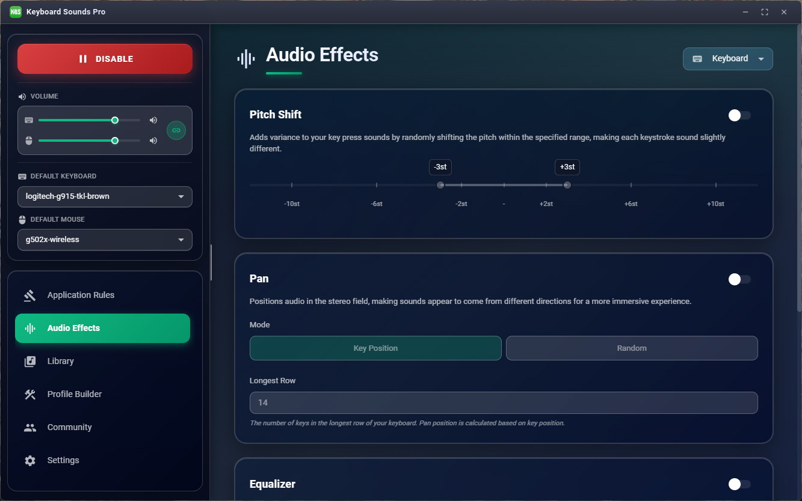
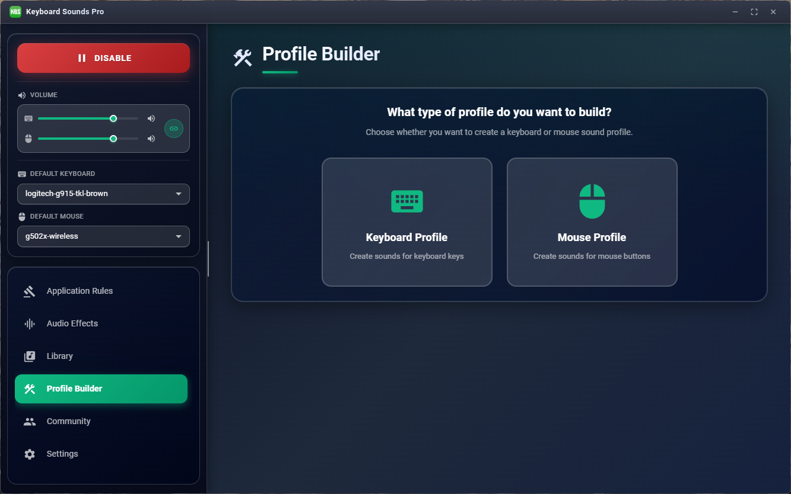
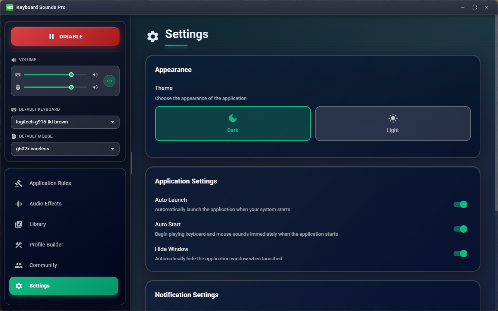
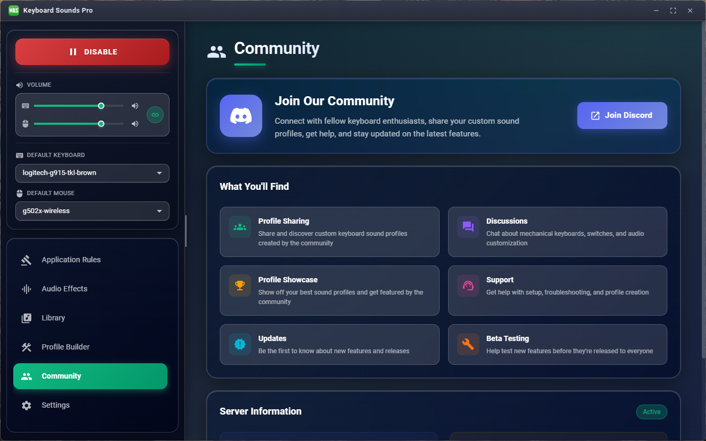

# Keyboard Sounds Pro

Keyboard Sounds Pro is a desktop application that will play customizable keyboard and mouse sounds while you work.

## Download

> [!WARNING]\
> Keyboard Sounds Pro is currently in beta. If you have issues, please report them [here](https://github.com/keyboard-sounds/keyboardsounds-pro/issues).

Download the latest release from the [releases page](https://github.com/keyboard-sounds/keyboardsounds-pro/releases/latest).

## Features

- Play customizable keyboard and mouse sounds while you work.
- Application rules to apply specific sound profiles to specific applications.
- Per-device volume and audio effects.
- Import and export sound profiles to share with others.
- Customize and build your own sound profiles and share them with others.

## Screenshots

