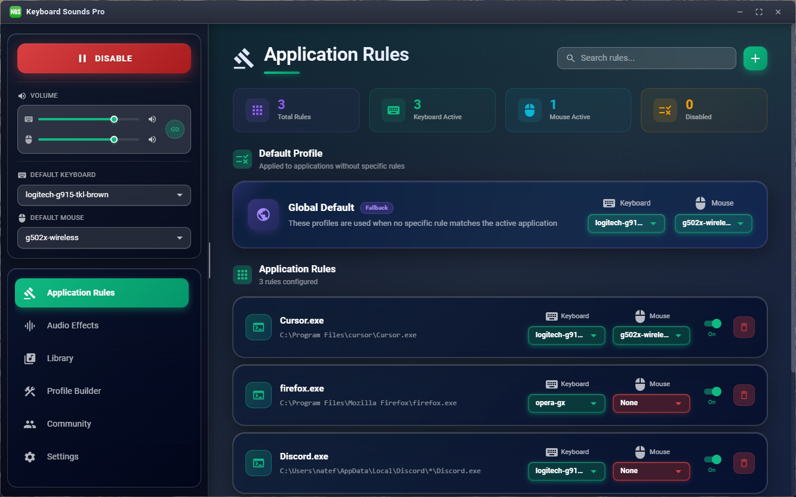

# Keyboard Sounds Pro

[](https://discord.gg/gysskqts6z)
[](https://github.com/sponsors/nathan-fiscaletti)

Keyboard Sounds Pro is a desktop application that will play customizable keyboard and mouse sounds while you work.



## Download

> [!WARNING]\
> Keyboard Sounds Pro is currently in beta. If you have issues, please report them [here](https://github.com/keyboard-sounds/keyboardsounds-pro/issues).

Download the latest release from the [releases page](https://github.com/keyboard-sounds/keyboardsounds-pro/releases/latest).

## Features

- Play customizable keyboard and mouse sounds while you work.
- Application rules to apply specific sound profiles to specific applications.
- Per-device volume and audio effects.
- Import and export sound profiles to share with others.
- Customize and build your own sound profiles and share them with others.
- Customizable hotkeys to control the application.

## Use the Keyboard Sounds Backend

Keyboard Sounds Pro uses the Keyboard Sounds backend to manage profiles, audio, keyboard and mouse events, and application rules. This backend is made entirely public and is free to use to develop your own applications.

For detailed documentation, see the [API documentation](https://pkg.go.dev/github.com/keyboard-sounds/keyboardsounds-pro/backend) and [examples](https://github.com/keyboard-sounds/keyboardsounds-pro/tree/main/backend/internal/cmd/example).

```sh
$ go get github.com/keyboard-sounds/keyboardsounds-pro/backend
```

```go
package main

import (
	"os"
	"log"

	kbs "github.com/keyboard-sounds/keyboardsounds-pro/backend"
	"github.com/keyboard-sounds/keyboardsounds-pro/backend/manager"
)

func main() {
	mgr, err := manager.NewManager(kbs.GetHomeDirectory())
	if err != nil{
		log.Fatalf("Failed to create manager: %v", err)
	}

	err = mgr.Enable()
	if err != nil{
		log.Fatalf("Failed to enable manager: %v", err)
	}

	// Wait indefinitely.
	select {}
}
```