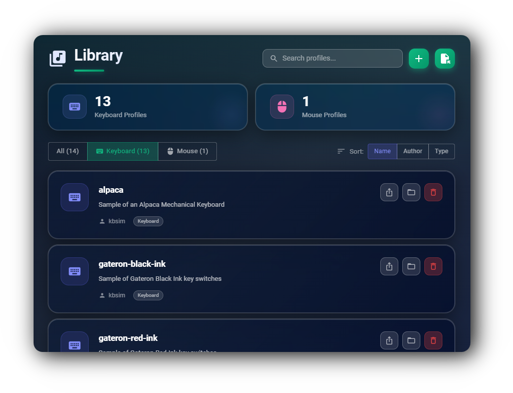
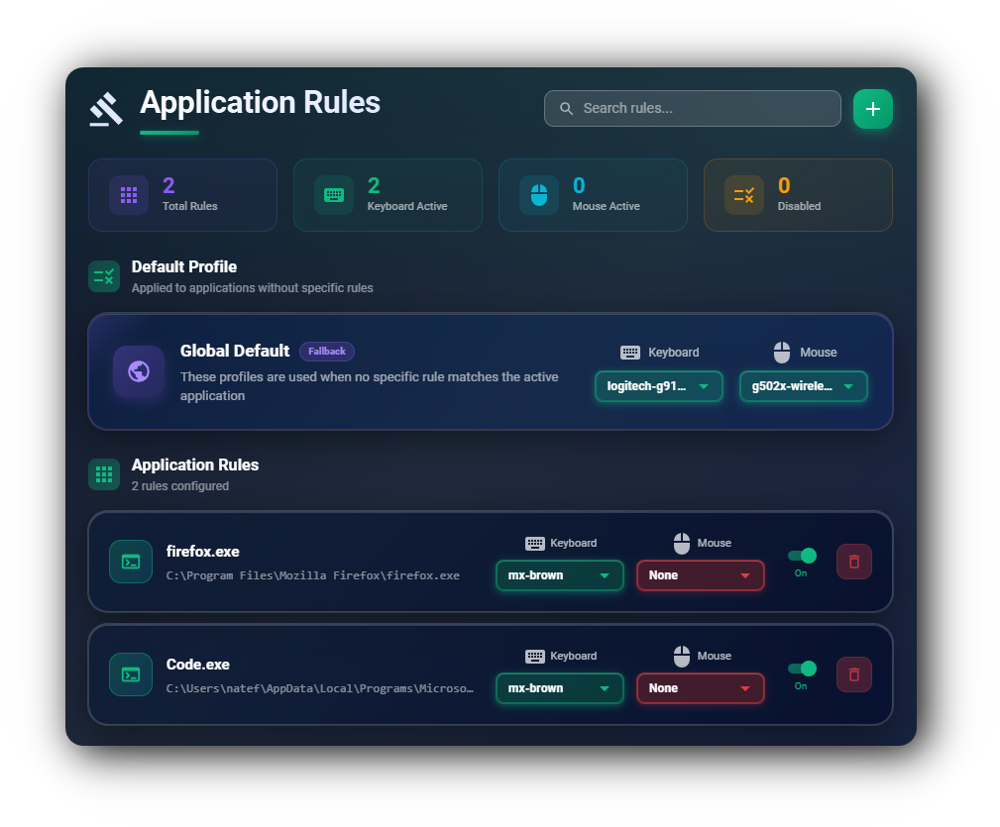
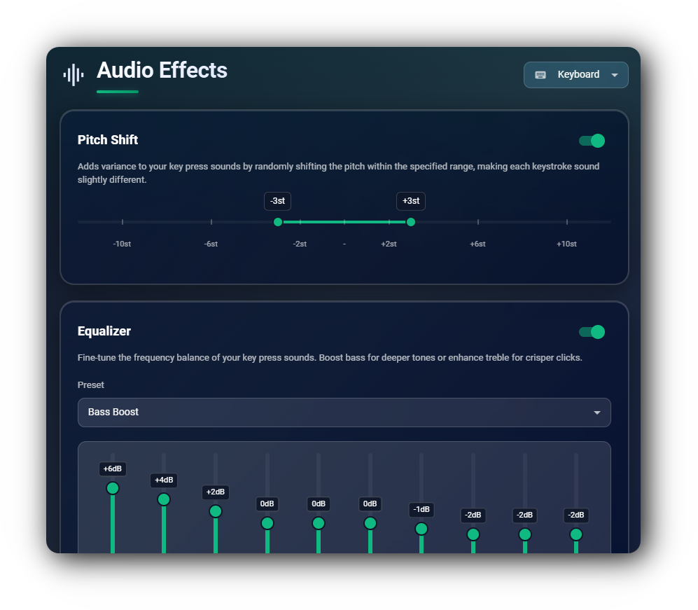
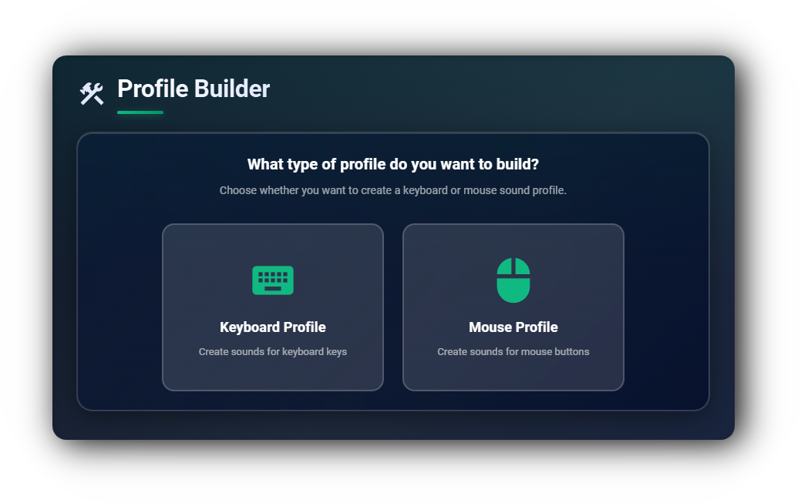
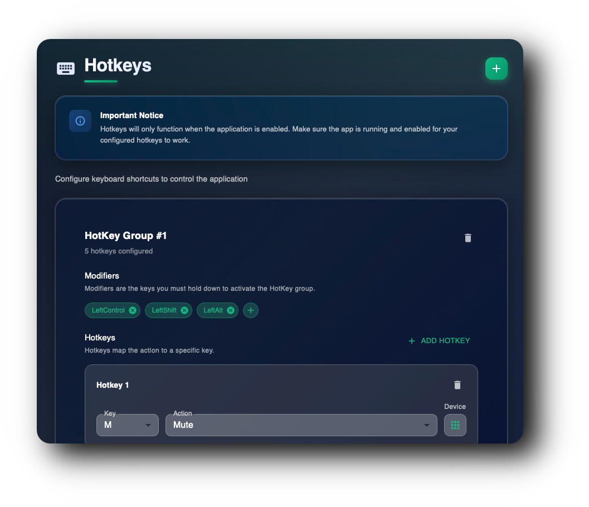
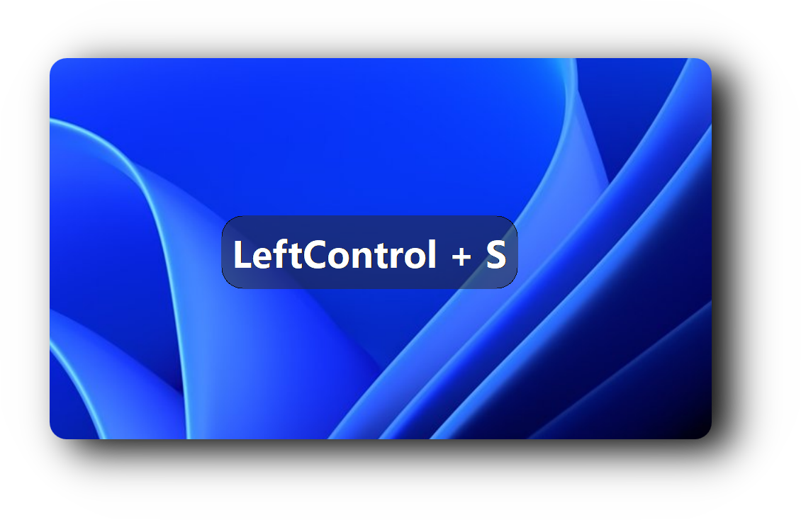

# Keyboard Sounds Pro

Keyboard Sounds Pro is a desktop application that will play customizable keyboard and mouse sounds while you work.

## Download

|Platform|Download|Information|
|---|:---:|---|
|macOS||The App Store version is a paid download which helps support development.|
|Windows|[Download on GitHub](https://github.com/keyboard-sounds/keyboardsounds-pro/releases/latest)|There are no special requirements to install on Windows.|
|Linux|[Download on GitHub](https://github.com/keyboard-sounds/keyboardsounds-pro/releases/latest)|On Linux, you need to grant permissions for the tool to work. See [./docs/linux.md](./docs/linux.md).|
|Other|[Build from Source](./docs/development.md)|This project is open source and can be built from source for free on all platforms.|

## Features

- Play customizable keyboard and mouse sounds while you work.
- Application rules to apply specific sound profiles to specific applications.
- Per-device volume and audio effects.
- Import and export sound profiles to share with others.
- Customize and build your own sound profiles and share them with others.
- Customizable hotkeys to control the application.
- On-screen keyboard shortcut display.

## Custom Profiles

 

- Support for both **Mouse** and **Keyboard** audio profiles
- Comes bundled with **twenty** built in profiles (13 keyboard, 7 mouse)
- Supports Custom profiles through the editors (`.wav` and `.mp3` supported)
- Supports importing and exporting profiles to share with others.

   

## Application Rules

 

- Keyboard Sounds supports application rules in which you can control the behavior of the sound daemon based on the currently focused application.

- This allows you to do things like only enabling in your text editor or terminal, disabling it for specific games, or localizing the sound effects to a particular application.

    

## Audio Effects

 

Keyboard Sounds Pro supports several audio effects to customize the sound of your keyboard and mouse.

- **Pitch Shift** - Change the pitch of the sound based on a range of values.
- **Pan** - Pan the sound to the left or right audio channel.
- **Equalizer** - Adjust the frequency response of the sound to your liking.

    

## Profile Builder

 

Keyboard Sounds Pro supports building your own profiles using audio files you provide. These profiles can then be shared with others and imported into the application.

- Build your own profiles using the profile builders.
- Supports building both keyboard and mouse profiles.
- Supports .wav and .mp3 audio files.

 

## Hot Keys

 

Keyboard Sounds Pro supports customizable hot keys for controlling the application quickly and easily without the need to open it and make changes.

- Hot key groups based on modifier key list
- Map actions to hot keys
- Customize values (i.e. volume steps)

    

## On-screen modifiers

 

Keyboard Sounds Pro supports a special feature for screen sharing that will display a brief pop-up each time you use a modifier-key combination.

- Perfect for tutorials, livestreams and learning keyboard shortcuts.
- Fully customizable display (color, opacity, size, offset, etc.)

 

## Development

You can easily build Keyboard Sounds Pro from source locally or use the Keyboard Sounds Backend in your own application. See [Development](./docs/development.md) for more information.

## Stargazers over time

