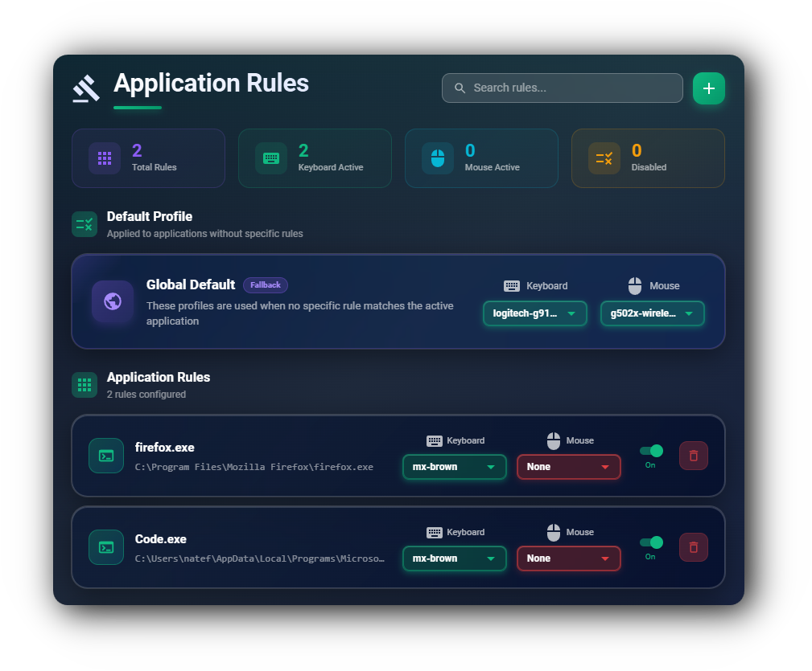
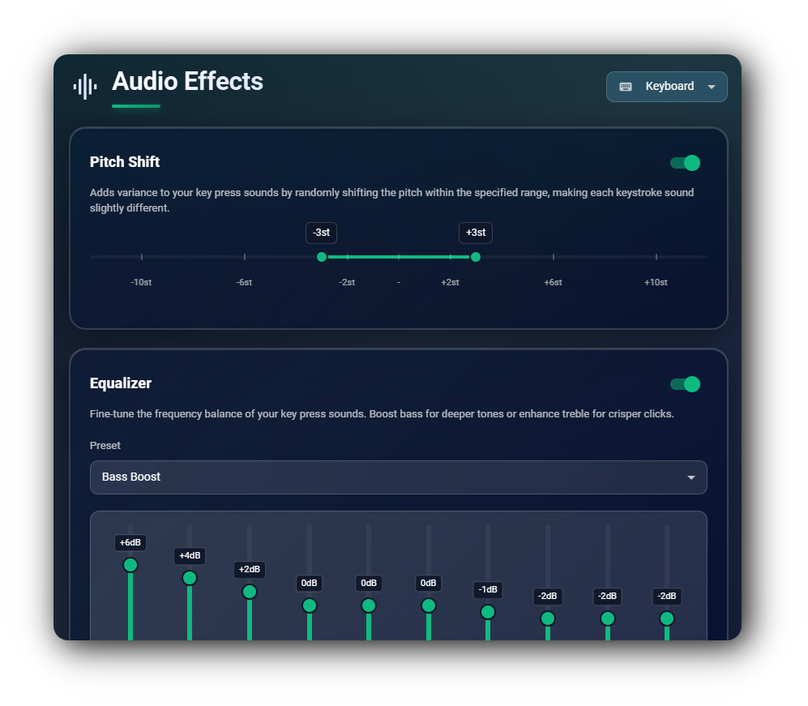
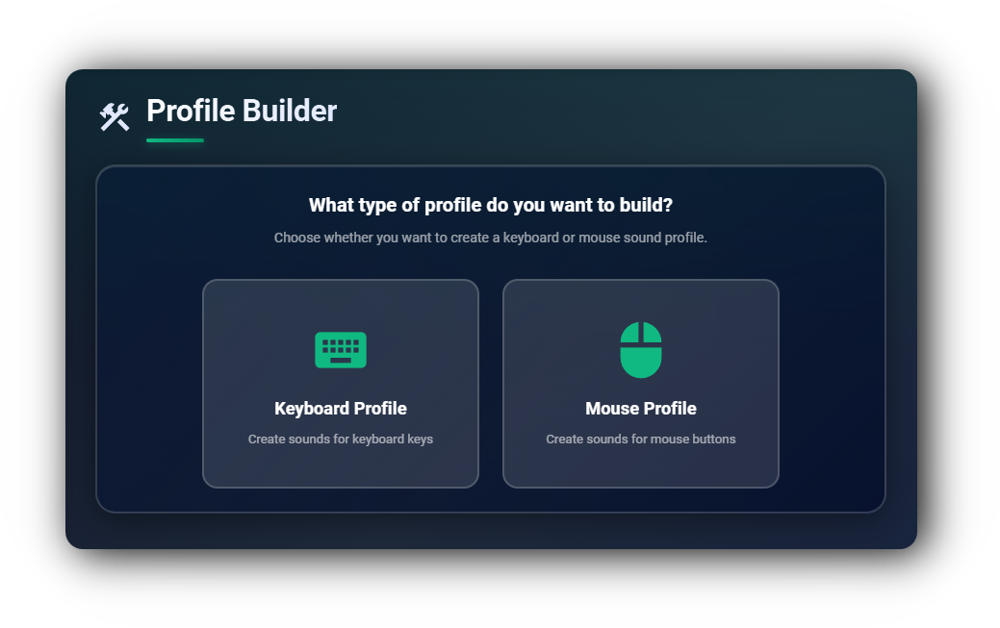

# Keyboard Sounds Pro

[](https://discord.gg/gysskqts6z)
[](https://github.com/sponsors/nathan-fiscaletti)

> [!WARNING]\
> Keyboard Sounds Pro is currently in beta. If you have issues, please report them [here](https://github.com/keyboard-sounds/keyboardsounds-pro/issues).

Keyboard Sounds Pro is a desktop application that will play customizable keyboard and mouse sounds while you work.


## Download

Download the latest release from the [releases page](https://github.com/keyboard-sounds/keyboardsounds-pro/releases/latest).

## Features

- Play customizable keyboard and mouse sounds while you work.
- Application rules to apply specific sound profiles to specific applications.
- Per-device volume and audio effects.
- Import and export sound profiles to share with others.
- Customize and build your own sound profiles and share them with others.
- Customizable hotkeys to control the application.

## Custom Profiles


<br>

- Support for both **Mouse** and **Keyboard** audio profiles
- Comes bundled with fourteen built in profiles (13 keyboard, 1 mouse)
- Supports Custom profiles through the editors (`.wav` and `.mp3` supported)
- Supports importing and exporting profiles to share with others.

<br><br><br><br><br><br>

## Application Rules



<br>

- Keyboard Sounds supports application rules in which you can control the behavior of the sound daemon based on the currently focused application.

- This allows you to do things like only enabling in your text editor or terminal, disabling it for specific games, or localizing the sound effects to a particular application.

<br><br><br><br><br><br>

## Audio Effects



<br>

Keyboard Sounds Pro supports several audio effects to customize the sound of your keyboard and mouse.

- **Pitch Shift** - Change the pitch of the sound based on a range of values.
- **Pan** - Pan the sound to the left or right audio channel.
- **Equalizer** - Adjust the frequency response of the sound to your liking.

<br><br><br><br><br><br>

## Profile Builder



<br>

Keyboard Sounds Pro supports building your own profiles using audio files you provide. These profiles can then be shared with others and imported into the application.

- Build your own profiles using the profile builders.
- Supports building both keyboard and mouse profiles.
- Supports .wav and .mp3 audio files.

<br><br><br>

## Use the Keyboard Sounds Backend

Keyboard Sounds Pro uses the Keyboard Sounds backend to manage profiles, audio, keyboard and mouse events, and application rules. This backend is made entirely public and is free to use to develop your own applications.

For detailed documentation, see the [API documentation](https://pkg.go.dev/github.com/keyboard-sounds/keyboardsounds-pro/backend) and [examples](https://github.com/keyboard-sounds/keyboardsounds-pro/tree/main/backend/internal/cmd/example).

```sh
$ go get github.com/keyboard-sounds/keyboardsounds-pro/backend
```

```go
package main

import (
	"os"
	"log"

	kbs "github.com/keyboard-sounds/keyboardsounds-pro/backend"
	"github.com/keyboard-sounds/keyboardsounds-pro/backend/manager"
)

func main() {
	mgr, err := manager.NewManager(kbs.GetHomeDirectory())
	if err != nil{
		log.Fatalf("Failed to create manager: %v", err)
	}

	err = mgr.Enable()
	if err != nil{
		log.Fatalf("Failed to enable manager: %v", err)
	}

	// Wait indefinitely.
	select {}
}
```