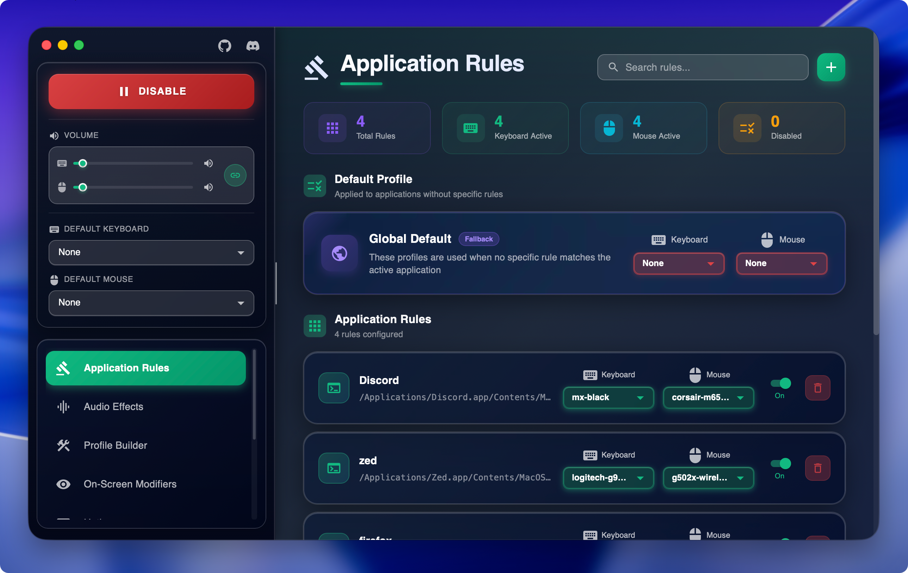

# Keyboard Sounds Pro - MacOS Support

Official macOS support is currently only available as a paid download through the Apple App Store. Purchasing the application through the app store helps support the development of the project.

If you do not wish to, or cannot afford to purchase the official application through the Apple App Store, you can alternatively [build the application](./development.md) yourself from source.
