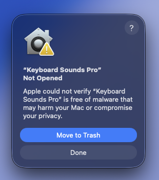
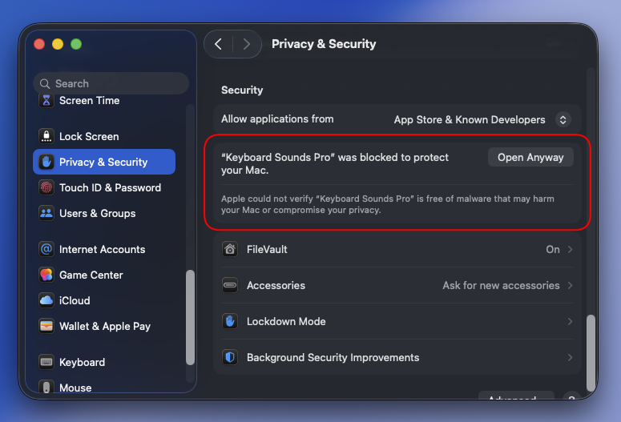
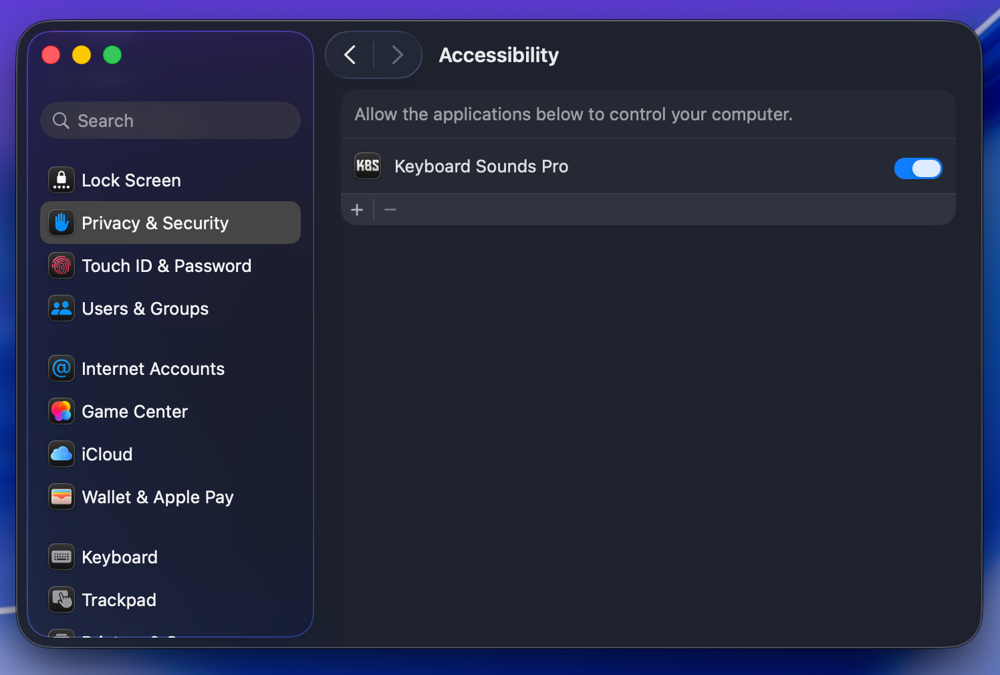
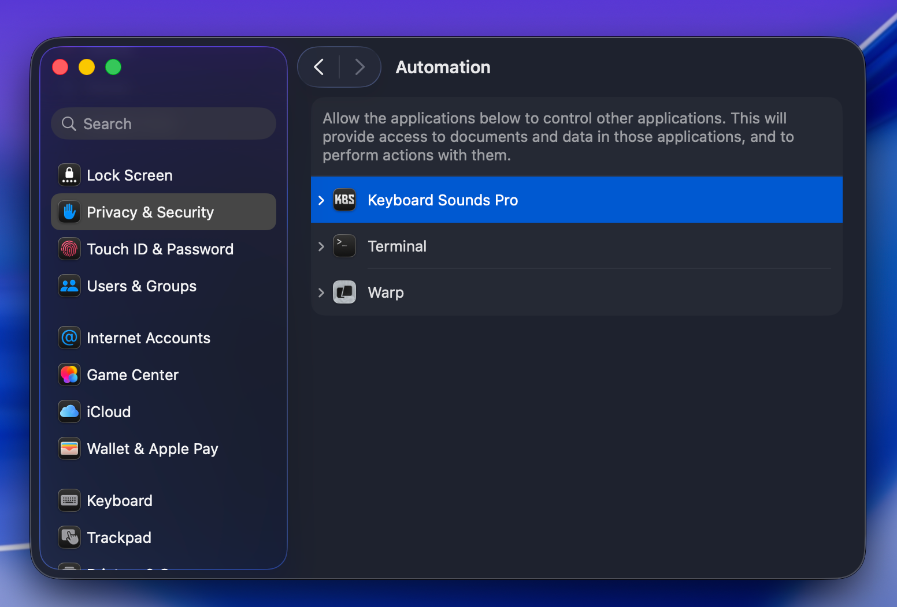
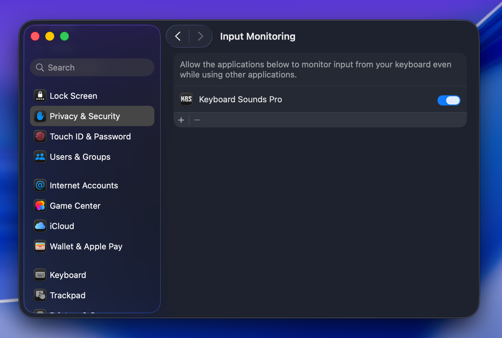

# Keyboard Sounds Pro - MacOS Support

[Download for macOS](https://github.com/keyboard-sounds/keyboardsounds-pro/releases/latest)

## Installing

After installing the application and attempting to run it for the first time, you may be presented with the following screen.

This is due to the application not being code signed with an official apple certificate.

Since I cannot afford the $100/year for an Apple Developer License, I have decided not to sign this application.

> If you would like to see this application properly signed and you're interested in supporting the project, you can [sponsor the project on GitHub](https://github.com/sponsors/nathan-fiscaletti).

In order to get around this, open your **System Settings** application, navigate to **"Privacy & Security"** and scroll to the very bottom of the page.

You should see the following. Click on the **Open Anyway** button to open the application and bypass the warning.

## Permissions

On MacOS, the application requires several permissions to be granted in the "Privacy & Security" section of your "System Settings" application in order for it to run properly.

Keyboard Sounds **should** automatically request these permissions the first time it launches. After granting them, you will need to fully restart the application.

### Accessibility

The Keyboard Sounds Pro application uses the Accessibility permission in order to detect the focused application. This is used in the application rules. Without this permission granted, detecting the currently focused application may not function as expected.

### Automation

The Keyboard Sounds Pro application uses the "System Events" permission under Automation as a fallback for detecting the focused application. This is used in the application rules when Accessibility is not enough. Without this permission granted, detecting the currently focused application may not function as expected.

### Input Monitoring

Keyboard Sounds Pro uses the Input Monitoring permission to listen for key strokes / mouse events in order to know when to trigger audio events. Without this permission granted, the application will not function as expected.
